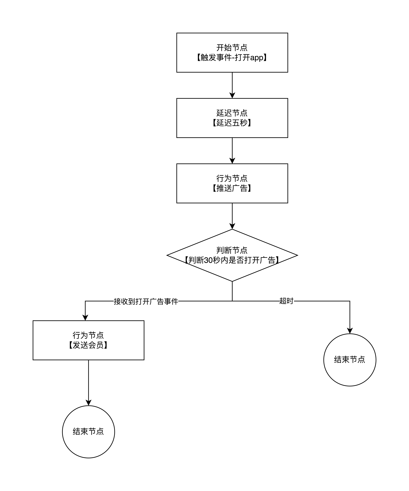

# akka-strategyProcess


###这是一个使用akka来模拟营销策略流执行的Demo
- 框架: akka-typed_2.8,  springboot_2.3  
- 语言: Java8  
- 构建工具: Maven

###使用方式

1, 添加策略流  
http://localhost:9999/releaseProcess
```json
{
    "processId": 11111111,
    "startEvent": "open_app",
    "nodes": [
        {
            "type": "start_node",
            "key": "main",
            "name": "开始节点-打开app",
            "next": {
                "key": "tn1"
            }
        },
        {
            "type": "timer_node",
            "key": "tn1",
            "name": "延迟5秒",
            "next": {
                "key": "an1"
            },
            "timeout": 5
        },
        {
            "type": "action_node",
            "key": "an1",
            "name": "推送广告",
            "next": {
                "key": "sn1"
            },
            "channelType": "app",
            "channelMsg": "这是一条广告~~~"
        },
        {
            "type": "switch_node",
            "key": "sn1",
            "name": "判断30秒是否打开广告",
            "next": {
                "key": "dn1"
            },
            "ruleEvent": "watch_ad",
            "timeout": 30,
            "ruleNext": {
                "key": "an2"
            }
        },
        {
            "type": "done_node",
            "key": "dn1",
            "name": "未观看广告-结束",
            "next": null
        },
        {
            "type": "action_node",
            "key": "an2",
            "name": "推送1小时app会员",
            "next": {
                "key": "dn2"
            },
            "channelType": "app",
            "channelMsg": "送你一小时会员~~~"
        },
        {
            "type": "done_node",
            "key": "dn2",
            "name": "观看广告-结束",
            "next": null
        }
    ]
}
```

策略流结构如下图:  


2, 发布事件  
http://localhost:9999/pushEvent  
首先发送打开app事件
```json
{
  "type": "open_app",
  "customerId": "wx_szwan",
  "msg": "我打开app了"
}
```
  
然后发送打开广告事件
```json
{
  "type": "watch_ad",
  "customerId": "wx_szwan",
  "msg": "我看广告了~~~"
}
```

